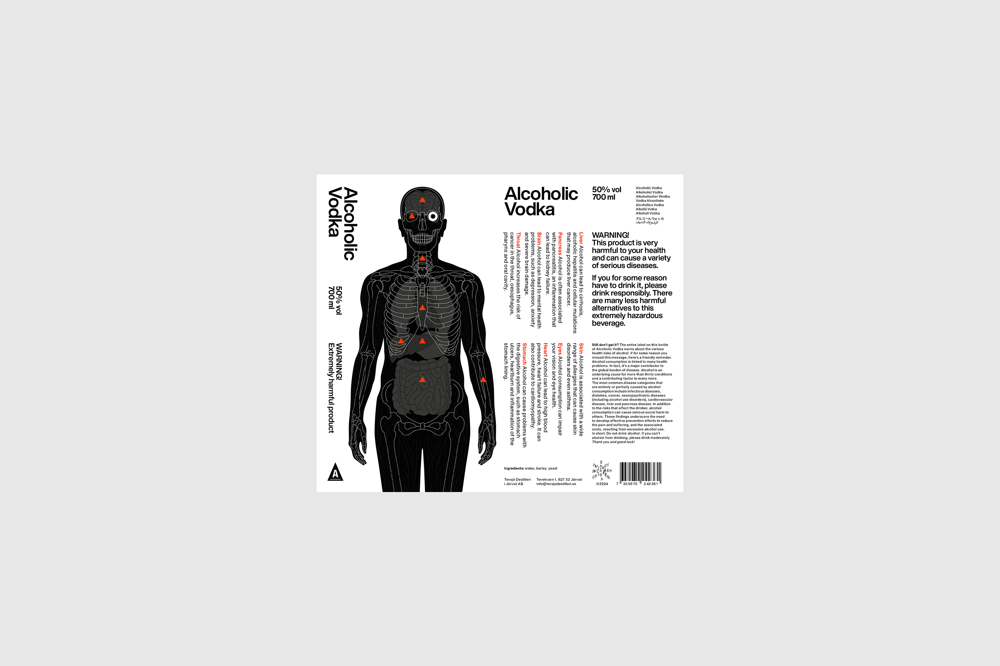
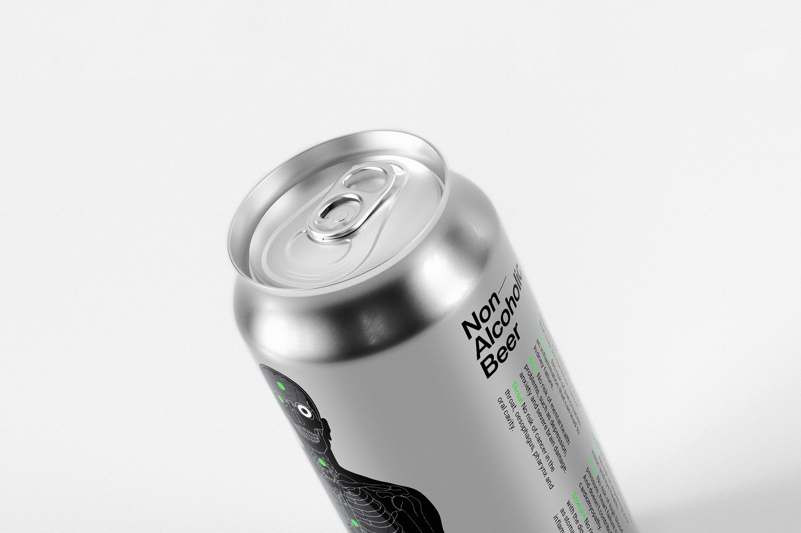

<h2 class="text-pretty text-4xl font-normal max-w-readable">
Alcoholic Vodka - which graphically warns about the alcoholic within all of us - is the world’s first vodka to list all deadly diseases linked to alcohol consumption on the bottle design.
</h2>

  
The product is entirely stripped of any sophisticated or stylized elements used to promote alcohol. Instead, it uses a no-nonsense, anatomically accurate image of a body ravaged by booze as a label.

With an estimated 3 million people dying each year from alcohol-related illnesses across Europe, what began as an experiment in transparency has resulted in a real, drinkable product that can provoke debate as consumers drink it. Using an actual product as a vehicle, much like a Trojan horse, Alcoholic Vodka helps to change attitudes in the very environment where alcohol is consumed. When the product is displayed on bars or at parties, the immediate conversation turns to the bottle; how much damage alcohol can cause, and concerns about whether individuals might be drinking too much. In short: It becomes its own media channel.

Our job was to design the full design experience including brand identity, packaging, bottle, digital experience as well as the side product Non-Alcoholic Beer. The result is a clear and consistent expression using contrasting visuals that stand out on the shelf and educate about the risks of alcohol consumption.

